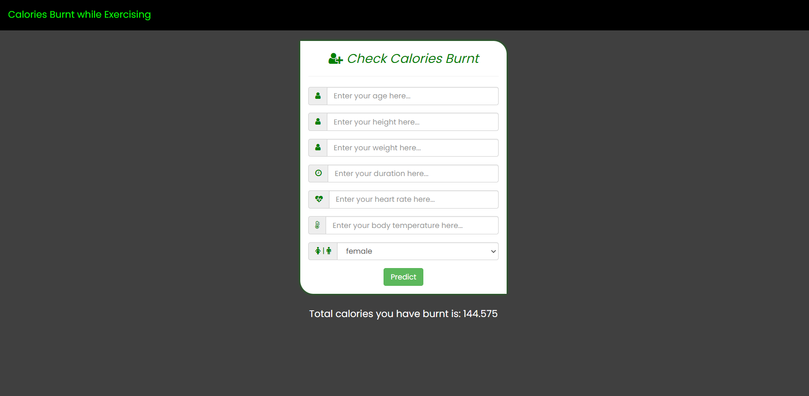

# Calories Burnt During Exercise Using ANN
<br><b><i>What happens to your body when you do exercise?</i></b>

When you exercise, heart rate increases to circulate more oxygen (via the blood) at a quicker pace. The calories will burn due to increase in heart rate, height, weight, body temperature, etc parameters.

## Work Flow:
- Data Collection
    - Collected calories burnt dataset from kaggle.
    - Dataset Link: https://www.kaggle.com/datasets/fmendes/fmendesdat263xdemos?select=exercise.csv.
    - The data have User_Id, Gender, Height, Weight, Duration, Heart Rate, Body Temp, and Calories.
        - User_Id : Unique Id of the user
        - Gender : Gender of the user
        - Height : Height of the user
        - Weight : Weight of the user
        - Duration : Time taken while doing exercise
        - Heart Rate : Heart rate while doing exercise
        - Body Temp : Body temperature while doing exercise
        - Calories : Calories burnt while doing exercise
- Data Pre-processing
    - Get some basic information about the data.
    - Check if there is any null values or not and if there is then apply different ways to handle null values.
- Data Analysis
    - Get statistical measures of the dataset.
    - Created charts or graphs for analyzing data like check distribution of data, outliers in data, etc.
- Model Creation
    - Implemented feature engineering like feature encoding and feature scaling.
    - Created model using ANN(Artificial Neural Network) architecture using Tensorflow and Keras.
- Model Evaluation
    - Evaluated model using Mean Squared Error, Mean Absolute Error, R-Squared, and Adjusted R-Squared.
- Creating Web App using Flask
    - Created simple UI using flask framework.
- Run the Web App using Docker
    - Created docker image of web app and run it into docker container.

## Screenshots
<table>
    <thead>
        <tr>
            <th>Home Page</th>
        </tr>
    </thead>
    <tbody>
        <tr>
            <td></td>
        </tr>
    </tbody>
</table>

## Run web app in Docker
Run following commands to run app in docker.
```powershell
docker build -t caloriesburntapp .
docker run -p 8000:8000 caloriesburntapp
```

## Tools & Technologies Used
- Python
- Flask
- Tensorflow, Keras
- Pandas, Numpy, Matplotlib